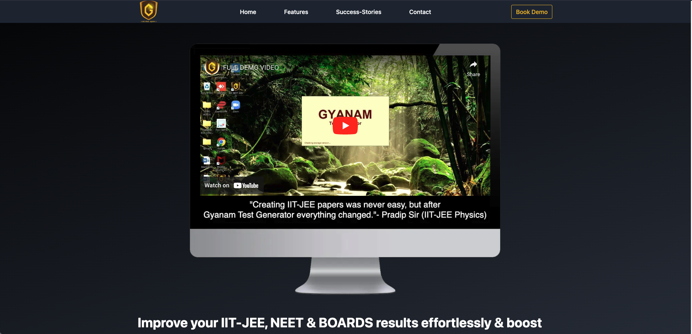
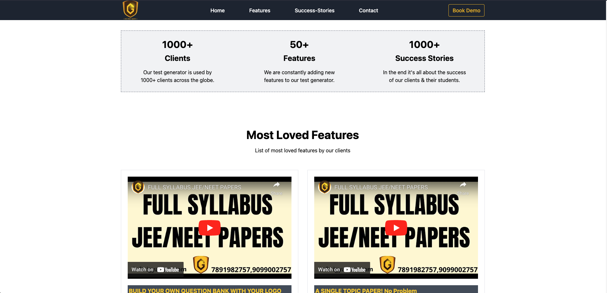
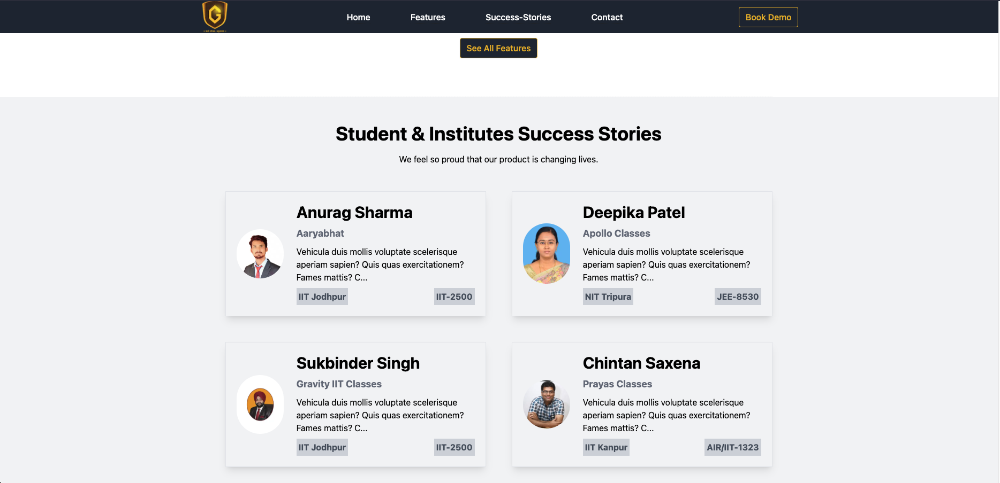
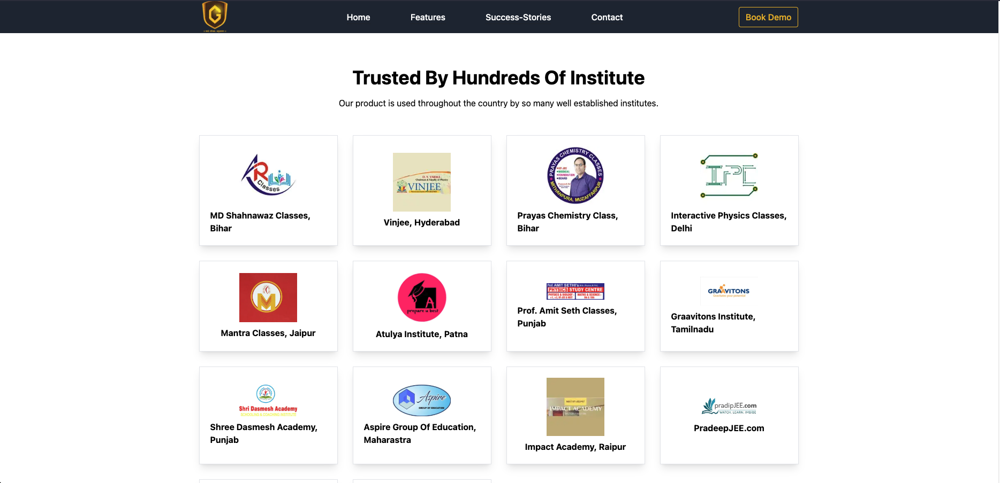
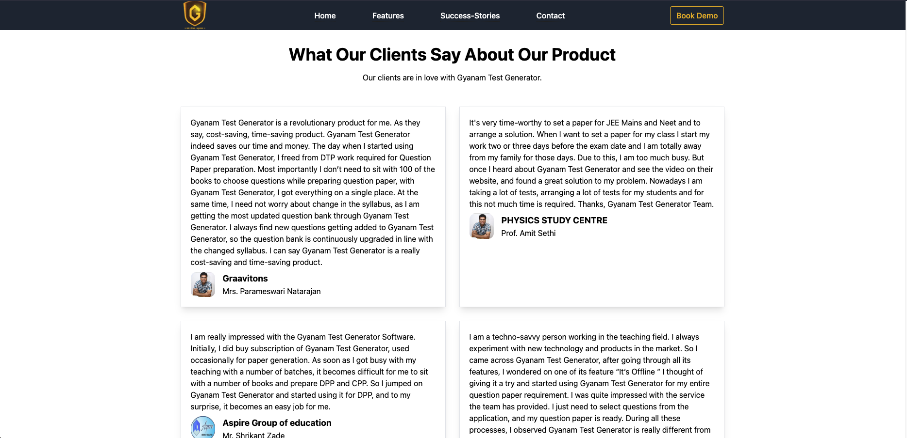
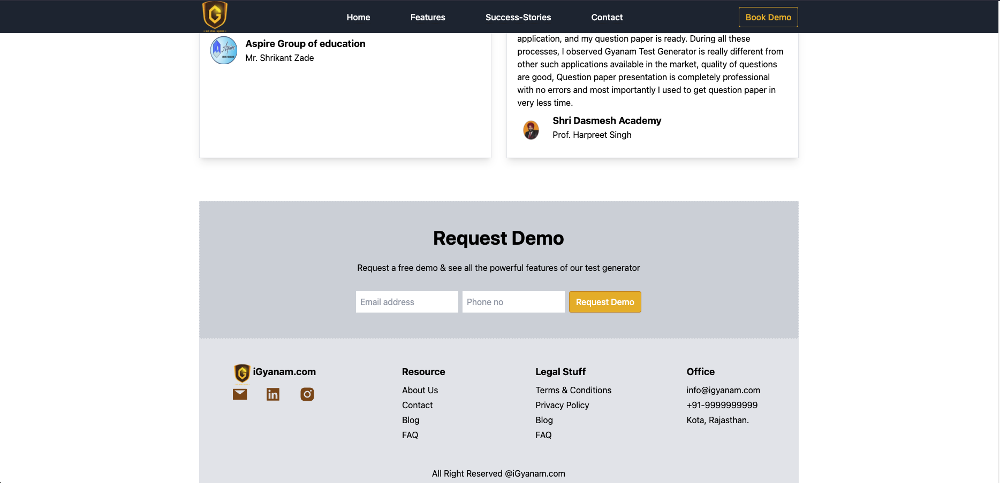
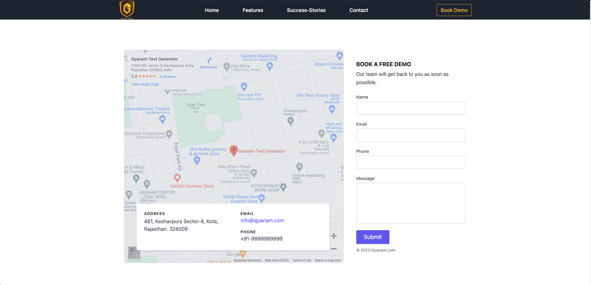
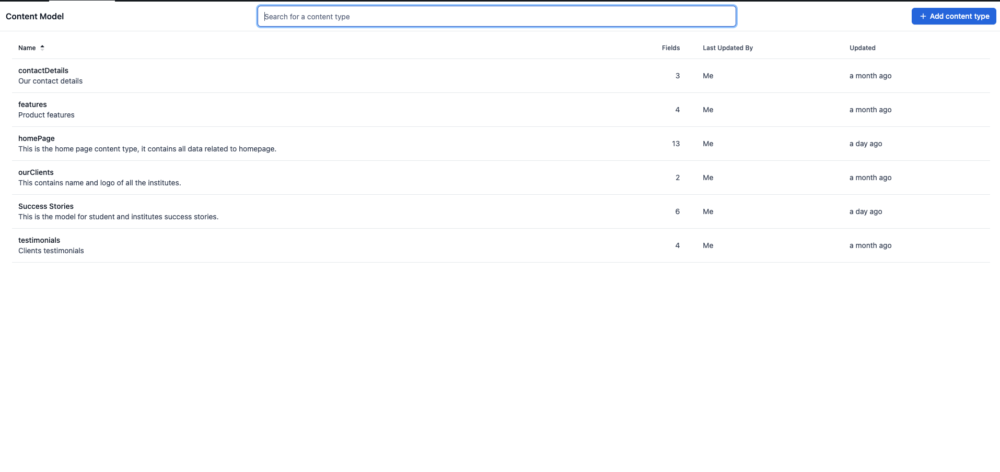
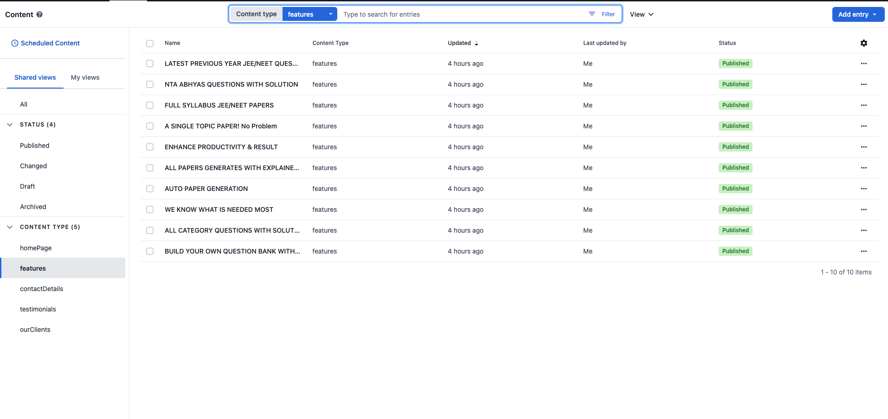

# About Project

## Description
- This is a business landing page for a SAAS company. 
- Client wanted a simple and clean design & ability to add or change data if required. Using contentful CMS, client can easily add or change data.  
- Also user can easily book demo or contact us. So added getform.io for that.

## Design Inspiration
Design inspiration is taken from this community figma design.
- [Figma Design](https://www.figma.com/file/CAUUY9dYJELwSHoeQEQpl0/BWA---Gear-(Community)?node-id=1-3)

## Technologies
- Next.js
- Contentful CMS
- Tailwind CSS
- getform.io

## Here is the link to the live site
- [Live Site](https://igyanam.vercel.app)

## Here are some screenshots of the site

